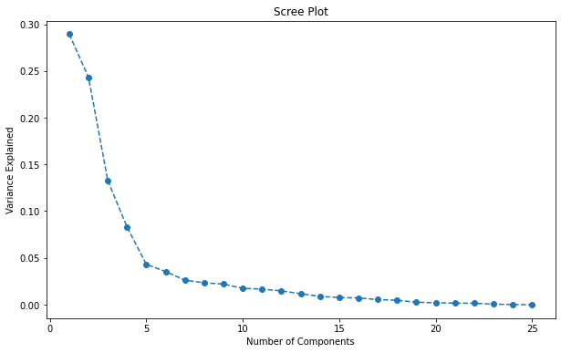
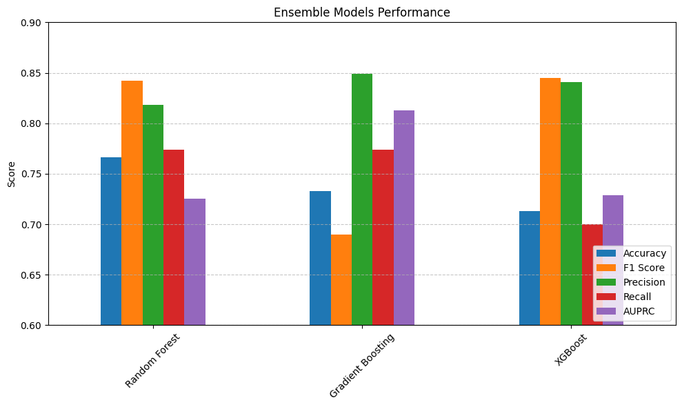
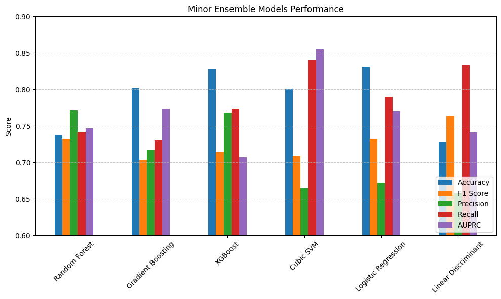
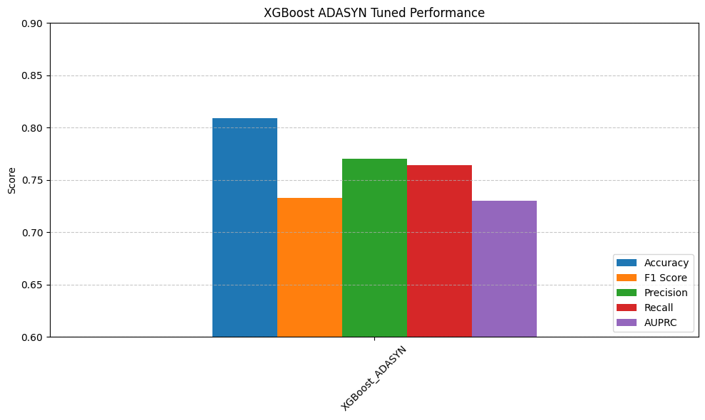
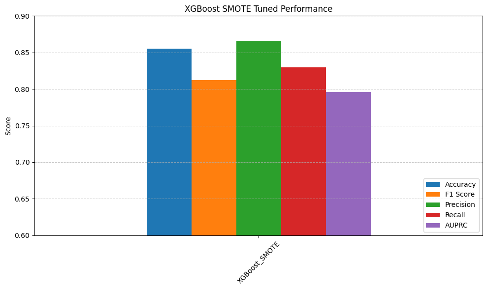

# Machine Learning Modeling and Evaluation

## Overview

This notebook outlines the machine learning modeling pipeline, including model evaluation, hyperparameter tuning, PCA-based feature selection, and model comparison for predicting event severity.

---

## Step 1: Preparing the Data

### Feature and Target Separation

```python
X = union_all_groups.drop('isSeverefirst', axis=1)
y = union_all_groups['isSeverefirst']
```

### Feature Scaling

Scaling ensures equal contribution from all features:

```python
from sklearn.preprocessing import StandardScaler

scaler = StandardScaler()
X_scaled = scaler.fit_transform(X)
```

---

## Step 2: Dimensionality Reduction with PCA

PCA identifies key features and removes redundancy:

```python
from sklearn.decomposition import PCA

pca = PCA()
X_pca = pca.fit_transform(X_scaled)

# Plot PCA variance explained
# 

# Determine feature importance based on PCA loading scores
loading_scores = pd.Series(pca.components_[0], index=X.columns)
sorted_loading_scores = loading_scores.abs().sort_values(ascending=False)

# Remove less important features
columns_to_remove = [col for col, score in sorted_loading_scores.items() if score < 0.1]
union_all_groups.drop(columns=columns_to_remove, inplace=True)
```

---


## Step 3: Model Evaluation and Selection

Evaluate multiple machine learning models using cross-validation to determine the best predictive performance and robustness to class imbalance:

### Models Evaluated

- Random Forest
- Gradient Boosting
- XGBoost
- Cubic SVM
- Logistic Regression
- Linear Discriminant Analysis

The following scoring metrics were specifically chosen for comprehensive model evaluation:
- **F1-score (weighted)**: Balances precision and recall, essential for datasets with imbalanced classes.
- **Precision (weighted)**: Measures the accuracy of positive predictions, indicating how reliable the positive class predictions are.
- **Recall (weighted)**: Reflects the model's ability to capture positive cases, crucial for event severity prediction.
- **AUPRC (Average Precision)**: Provides a robust assessment of model performance in imbalanced classification scenarios, capturing precision-recall trade-offs.

### Model Evaluation Function (Snippet)

```python
from sklearn.model_selection import cross_validate, StratifiedKFold
from sklearn.ensemble import RandomForestClassifier, GradientBoostingClassifier
from xgboost import XGBClassifier
from sklearn.svm import SVC
from sklearn.linear_model import LogisticRegression
from sklearn.discriminant_analysis import LinearDiscriminantAnalysis

models = {
    "Random Forest": RandomForestClassifier(n_estimators=100, class_weight='balanced', random_state=42),
    "Gradient Boosting": GradientBoostingClassifier(n_estimators=100, random_state=42),
    "XGBoost": XGBClassifier(scale_pos_weight=(len(y)-sum(y))/sum(y), eval_metric='logloss', random_state=42),
    "Cubic SVM": SVC(kernel='poly', degree=3, class_weight='balanced', probability=True),
    "Logistic Regression": LogisticRegression(class_weight='balanced', max_iter=5000, solver='saga'),
    "Linear Discriminant": LinearDiscriminantAnalysis()
}

cv = StratifiedKFold(n_splits=5, shuffle=True, random_state=42)

results = {}
for name, model in models.items():
    cv_results = cross_validate(model, X_scaled, y, cv=cv, scoring=['f1_weighted', 'precision_weighted', 'recall_weighted', 'average_precision'])
    results[name] = {metric: np.mean(scores) for metric, scores in cv_results.items()}

# Include a comparison plot here
# 
```

---




## Step 4: Hyperparameter Tuning

Optimizing the best-performing models (XGBoost) using SMOTE and ADASYN to handle imbalanced data:

### XGBoost with ADASYN

```python
from imblearn.pipeline import Pipeline as ImbPipeline
from imblearn.over_sampling import ADASYN
from sklearn.model_selection import GridSearchCV

pipeline = ImbPipeline([
    ('ADASYN', ADASYN(random_state=42)),
    ('xg', XGBClassifier(eval_metric='logloss', random_state=42))
])

params = {
    'xg__n_estimators': [100, 200],
    'xg__max_depth': [6, 10],
    'xg__learning_rate': [0.1, 0.01],
    'xg__gamma': [0, 0.1, 0.2],
    'xg__subsample': [0.6, 0.8, 1.0],
    'xg__colsample_bytree': [0.6, 0.8, 1.0]
}

cv = StratifiedKFold(n_splits=5, shuffle=True, random_state=42)
grid_search = GridSearchCV(pipeline, params, cv=cv, scoring='f1_weighted', n_jobs=-1)
grid_search.fit(X_scaled, y)

best_params_adasyn = grid_search.best_params_
```

### XGBoost with SMOTE

```python
from imblearn.over_sampling import SMOTE

pipeline_smote = ImbPipeline([
    ('SMOTE', SMOTE(random_state=42)),
    ('xg', XGBClassifier(eval_metric='logloss', random_state=42))
])

params_smote = params  # same parameter grid as ADASYN

grid_search_smote = GridSearchCV(pipeline_smote, params_smote, cv=cv, scoring='f1_weighted', n_jobs=-1)
grid_search_smote.fit(X_scaled, y)

best_params_smote = grid_search_smote.best_params_
```

---




## Step 5: Final Model Selection and Deployment

The final model was selected based on cross-validation performance, optimal hyperparameters, and robustness to class imbalance. This optimized model was serialized and deployed to production.

---

## Behavioral Insights

- **XGBoost** and **Random Forest** consistently outperformed others, likely due to robustness in handling complex feature interactions.
- Handling class imbalance using **ADASYN/SMOTE** greatly improved predictive performance on minority class events.
- PCA effectively highlighted the most influential features, streamlining the modeling pipeline and improving interpretability.

---

This notebook summarizes the structured approach taken to ensure a robust, reliable, and effective predictive modeling pipeline.
